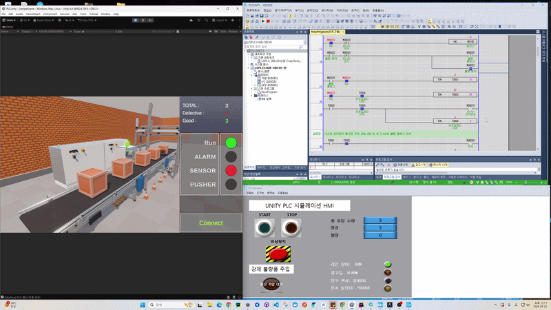

# 🏭 스마트 물류 컨베이어 & 불량 선별 디지털 트윈 시스템
> **XG5000(Virtual PLC) + XP-Builder(HMI) + Unity 3D 실시간 동기화 포트폴리오**




---

## 📌 1. 프로젝트 개요
* **목표**: 물리 설비 없이 가상 환경(Single PC)에서 산업용 PLC 제어 로직, HMI 터치 관제 화면, 3D 물리 시뮬레이터를 1:1로 실시간 동기화한 스마트 물류 분류 시스템 구현
* **핵심 기능**:
  - HMI 조작 기반 컨베이어 라인 기동/정지 및 비상정지(E-Stop) 제어
  - 물류 입구 포토센서 감지 및 자동 제품 카운팅
  - 실시간 불량 강제 주입 트리거 및 타이머 기반 푸셔(Pusher) 실린더 선별 동작
  - 타워 램프 및 통합 관제 대시보드 데이터 실시간 동기화

---

## 🛠 2. 기술 스택 & 통신 아키텍처
* **PLC Programming**: LS ELECTRIC XG5000 (XGK/XGB Virtual PLC Simulator)
* **HMI Design**: LS ELECTRIC XP-Builder
* **Digital Twin / 3D Simulation**: Unity 3D (URP, Physics Rigidbody, Mesh Texture Scrolling)
* **Communication Protocol**: Modbus TCP (Ethernet / NModbus 라이브러리 연동, Polling 50ms)


```text
[ XP-Builder (HMI) ] 
        ↕ (LS XGT Protocol / Internal)
[ XG5000 (Virtual PLC Simulator) ] 
        ↕ (Modbus TCP Server / Port: 502)
[ Unity 3D (C# NModbus Client) ]
        ├─ PLCConnect.cs (50ms 실시간 비동기 폴링 & 비트 변환)
        ├─ Conveyor.cs (텍스처 스크롤 & Rigidbody 물리 이송)
        └─ UICanvas.cs (실시간 인디케이터 & 수량 모니터링)
